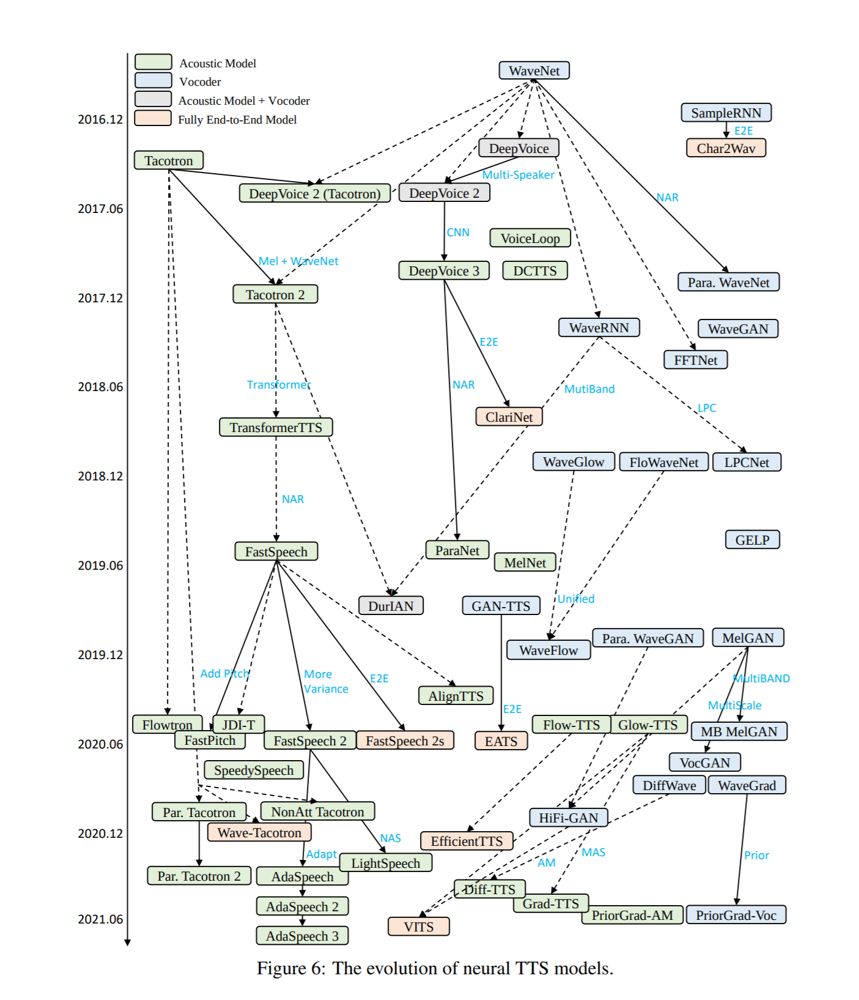

# orchest-coqui-tts
This repository demonstrates an Orchest pipeline that generates an audio fragment using the [coqui](https://github.com/coqui-ai/TTS) TTS engine and sends it as a message on Slack

## Environment variables
If you want to send this to your actual Slack channel you need a bot with `chat:read/write` and `file:read/write` permissions and set the `SLACK_BOT_TOKEN` environment variable.

Make sure you add the bot to the desired channel. The Slack channel can be overwritten by specifying the `SLACK_CHANNEL` environment variable.

## Speakers

Check out the [speaker_id_samples.zip](speaker_id_samples.zip) to find out the difference between the various speaker_id options of the [Coqui VITS](https://tts.readthedocs.io/en/latest/models/vits.html) model.

### Pipeline

## History of TTS models

The VITS model that's used is based off of earlier work in the field. For an overview of the evolution check out the evolution trajectories below:

For more details check out the paper about recent advancements in neural speech synthesis: [arxiv.org/abs/2106.15561](https://arxiv.org/abs/2106.15561)
